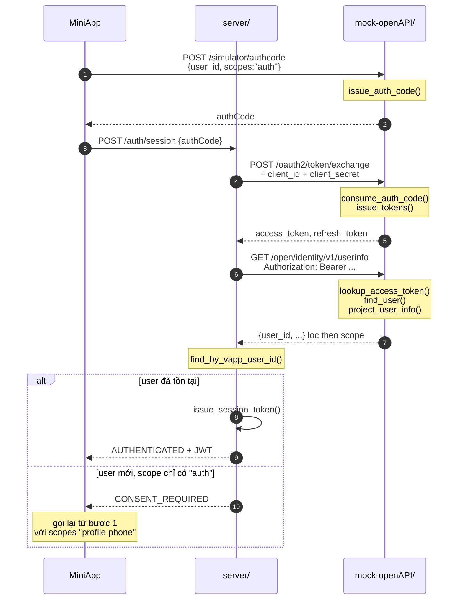

# Ngày 1 — Đăng nhập V-App

Tài liệu này giải thích code đã viết: ai gọi ai, dữ liệu nằm ở đâu, và mỗi hàm làm gì.

---

## 1. Ba thành phần

| Thư mục | Là gì | Cổng |
|---|---|---|
| `v-market/` | MiniApp (React + `@v-miniapp/ui-react`) | 8080–8999 |
| `server/` | MiniApp Backend | 4000 |
| `mock-openAPI/` | V-App Open API giả | 4001 |

**Vì sao MiniApp không gọi thẳng V-App?** Hai lý do cứng:

1. Đổi authCode lấy token cần `client_secret`. Để nó ở frontend thì ai xem source cũng tự phát token nhân danh app được.
2. Tài liệu V-App ghi rõ `user_id` chỉ lấy được từ backend. JSAPI `getUserInfo` cố tình chỉ trả tên/ảnh/giới tính — **không có định danh**.

Nên `getAuthCode` chỉ đẻ ra một **vé tạm vô hại**. Đổi vé đó lấy quyền thật thì phải có bí mật mà chỉ server giữ.

---

## 2. Ba loại vé

Đây là chỗ dễ rối nhất. Có **ba** thứ khác nhau, đừng nhầm lẫn:

| Vé | Ai cấp | Sống bao lâu | Dùng để | Ai giữ |
|---|---|---|---|---|
| `authCode` | V-App | 60 giây, **1 lần** | Đổi lấy access token | MiniApp → chuyển ngay cho backend |
| `access_token` | V-App | 1 giờ | Gọi Open API của V-App | **Chỉ backend** |
| `refresh_token` | V-App | dài | Xin access token mới | **Chỉ backend** |
| `JWT` | V-Market | 12 giờ | Gọi API của V-Market | MiniApp |

**`access_token` không bao giờ ra tới client.** Client chỉ cầm JWT của V-Market.

Vì sao phải qua `authCode` mà không cấp thẳng access token? Vì authCode đi qua tay client. Nếu nó bị lộ trên đường thì cũng vô dụng — kẻ lấy được không có `client_secret` để đổi. Đó là toàn bộ ý nghĩa của bước trung gian này.

---

## 3. Dữ liệu trong mock

`mock-openAPI/store.py` giữ ba bảng trong bộ nhớ (restart là sạch — đúng bản chất của bản mô phỏng):

```
_auth_codes      "ac_<uuid>"  →  {user_id, scopes, expires_at, used}
_access_tokens   "vat_<hex>"  →  {user_id, scopes, expires_at}
_refresh_tokens  "vrt_<hex>"  →  {user_id, scopes}
```

`authCode` có cờ `used`: `consume_auth_code()` đánh dấu ngay lần gọi đầu, gọi lần hai trả `"already_used"`. Hàm này trả về **một trong hai kiểu** — `(user_id, scopes)` nếu hợp lệ, hoặc một chuỗi lý do (`"not_found"` / `"expired"` / `"already_used"`). Bên gọi phân biệt bằng `isinstance(result, str)`.

Cộng `SEED_USERS` — 3 người dùng cố định:

| user_id | Tên |
|---|---|
| `1111...1111` | Nguyễn Thị Mua |
| `2222...2222` | Trần Văn Bán A |
| `3333...3333` | Lê Thị Bán B |

`user_id` để cố định để sau khi restart, dữ liệu seed bên V-Market vẫn khớp.

> V-App **không** biết ai là người mua, ai là người bán. Nó chỉ biết danh tính. Vai trò là dữ liệu của V-Market — xem §7.

---

## 4. Luồng đăng nhập



Bước 1 (`/simulator/authcode`) **không tồn tại trên V-App thật** — ở đó MiniApp gọi JSAPI `getAuthCode()`. Ta thay bằng endpoint này vì JSAPI cần `appIdentifier` đã đăng ký ở DevCenter.

---

## 5. Consent hai giai đoạn

Theo tài liệu `login-free-system`:

- Người dùng **cũ** chỉ cần scope `auth` — đăng nhập im lặng, không hiện màn hình xin quyền.
- Người dùng **mới** mới phải xin `profile phone`, và lúc đó mới hiện consent.

Kết quả: màn hình consent xuất hiện **đúng một lần trong đời** mỗi người dùng.

Backend nhận biết "đã xin consent chưa" bằng cách kiểm tra `info.get("name")` — vì scope `auth` không trả `name`. Không có cờ riêng nào cả.

Đó chính là lý do việc lọc theo scope ở §6 phải làm nghiêm túc: nếu mock trả `name` bất kể scope, nhánh này sai hoàn toàn. Hai chỗ đó dính chặt nhau.

---

## 6. Lọc theo scope

`project_user_info()` chỉ trả những trường mà scope cho phép:

| Scope | Trường được trả |
|---|---|
| `auth` | `user_id` |
| `profile` | `+ name, date_of_birth, gender, avatar_url` |
| `phone` | `+ phone_number` |
| `email` | `+ email` |

**Đây là quy tắc quan trọng nhất của cả bản mock.** Nếu trả đủ mọi trường bất kể scope, backend sẽ quen là lúc nào cũng có `phone_number`, rồi hỏng ở màn hình checkout khi ráp API thật — lúc đó đã là tuần 3.

> Ghi chú: SDK `@v-miniapp/apis@1.0.20` khai báo scope chỉ gồm `profile|phone|email`, **chưa có `auth`**, dù tài liệu có. SDK đi sau tài liệu; cần kiểm chứng lại khi có app đăng ký thật.

---

## 7. Hết hạn, và gia hạn không cần hỏi lại

JWT của V-Market sống **12 giờ** (`jwt_ttl_seconds`). Hết hạn thì mọi API cần
đăng nhập trả **401** — và điều đó là đúng.

**Không có refresh token, và cố ý không có.** `login-free-system` không định
nghĩa cái nào. Cách gia hạn của nền tảng là *gọi lại `getAuthCode(['auth'])`*
— im lặng với người đã đồng ý một lần — rồi đổi lấy phiên mới. Cất thêm một
credential sống lâu trên máy chỉ thêm thứ để mất, mà không mua được gì.

Nên **gia hạn chính là đăng nhập, chạy lại lặng lẽ**:

```
gọi API ─→ 401 ─→ loginSilently(vappUserId) ─→ token mới ─→ gọi lại đúng 1 lần
                          └─ không được ─→ signOut() ─→ /login
```

Đặt ở `lib/session-renew.ts`, nối vào transport qua `setSessionRenewer()`
chứ không import trực tiếp — nếu không sẽ thành vòng `client → auth → client`.
Vì vậy phiên lưu thêm `vappUserId` (khác `user.id` của V-Market), và khoá lưu
trữ lên `session.v2`.

Vài điểm cố ý:

- **Chỉ thử lại một lần**, và chỉ khi request có mang `Authorization`. 401 mà
  không có token là lỗi lập trình, không phải hết hạn.
- **Một lần gia hạn cho nhiều request.** Một màn hình bắn 3 lời gọi cùng lúc
  thì cả 3 cùng 401; chúng chia nhau một promise đăng nhập, không đua nhau.
- **Chạy lại được** vì `POST /orders` có `Idempotency-Key` — lần thử thứ hai
  trả về đơn đã tạo chứ không mua thêm lần nữa.
- **Mạng hỏng thì giữ nguyên phiên.** Không đá người ta ra khỏi giỏ hàng chỉ
  vì backend vừa restart.

> **Còn một nguyên nhân 401 nữa, hay gặp hơn cả hết hạn:** chạy `pytest` xoá
> sạch bảng, seed lại sinh **id mới**. Token cũ trỏ vào một user không còn
> tồn tại → `current_user` trả 401 `Unknown user`. Lúc này gia hạn nhận
> `CONSENT_REQUIRED` (tài khoản V-App còn, tài khoản V-Market thì không), nên
> phiên bị xoá và người dùng về màn đăng nhập — đúng thứ nên xảy ra.
>
> Phân biệt hai ca bằng chính body của 401: `Invalid or expired token` là hết
> hạn, `Unknown user` là DB đã bị xoá.

---

## 8. Tra hàm

### `mock-openAPI/store.py`

| Hàm | Làm gì |
|---|---|
| `parse_scopes(raw)` | Nhận cả `"profile phone"` lẫn `["profile","phone"]` (tài liệu viết cả hai kiểu), lọc bỏ scope lạ |
| `find_user(user_id)` | Tìm trong `SEED_USERS`, không có thì `None` |
| `issue_auth_code(user_id, scopes, ttl)` | Sinh `ac_<uuid>`, lưu kèm hạn |
| `consume_auth_code(code)` | Đánh dấu đã dùng. Trả `(user_id, scopes)` hoặc chuỗi lý do |
| `issue_tokens(user_id, scopes, ttl)` | Sinh cặp `vat_` + `vrt_`, lưu cả hai |
| `lookup_access_token(token)` | Trả `(user_id, scopes)`, hoặc `"not_found"` / `"expired"` |
| `consume_refresh_token(token)` | Trả bản ghi rồi **xoá** — refresh xoay vòng, mỗi lần cấp cặp mới |
| `project_user_info(user, scopes)` | Lọc trường theo scope — xem §6 |
| `reset()` | Xoá sạch, chỉ dùng khi test |

**`_opaque(prefix)`** sinh token bằng `secrets.token_hex(24)`. Token **không chứa dữ liệu gì** bên trong. Nếu nhét `user_id` vào token, sẽ có người decode nó ở backend thay vì gọi `userinfo` — và code đó chết ngay khi ráp API thật, vì token thật là chuỗi ngẫu nhiên.

### `mock-openAPI/main.py`

| Endpoint | Gọi hàm nào |
|---|---|
| `POST /oauth2/token/exchange` | `consume_auth_code` → `issue_tokens` |
| `POST /oauth2/token/refresh` | `consume_refresh_token` → `issue_tokens` |
| `GET /open/identity/v1/userinfo` | `lookup_access_token` → `find_user` → `project_user_info` |
| `GET /simulator/users` | liệt kê `SEED_USERS` |
| `POST /simulator/authcode` | `parse_scopes` → `issue_auth_code` |

Hai endpoint `/simulator/*` **không có trên V-App thật**.

### `server/app/vapp/gateway.py`

Nơi **duy nhất** gọi ra V-App.

| Hàm | Làm gì |
|---|---|
| `exchange_auth_code(code)` | `POST /oauth2/token/exchange` → `VAppToken` |
| `refresh_token(token)` | `POST /oauth2/token/refresh` → `VAppToken` |
| `get_user_info(access_token)` | `GET /open/identity/v1/userinfo` → `dict` |
| `_unwrap(response)` | Bóc envelope, ném `VAppApiError` nếu `code != 0` |

`_unwrap` là chỗ đáng chú ý: Open API bọc mọi thứ trong `{code, message, data}`, và **HTTP 200 vẫn có thể là lỗi**. Luôn xét `code`, đừng xét mỗi HTTP status.

Nó cũng cố ý **không** phân nhánh theo mã lỗi cụ thể, chỉ xét `code != 0`. Lý do: mã lỗi `102xx` cho authCode là do ta tự đặt (tài liệu V-App chưa công bố), nên nếu backend phụ thuộc vào con số đó thì ráp API thật sẽ sai.

### `server/app/users/store.py`

| Hàm | Làm gì |
|---|---|
| `find_by_vapp_user_id(id)` | Tra người dùng V-Market theo `user_id` của V-App |
| `create_user(vapp_user_id, name, phone)` | Tạo mới, gán `role` + `seller_id` từ bảng `_SEED_ROLES` |

`_SEED_ROLES` gán sẵn: `1111…` là `BUYER`, `2222…` là `SELLER/seller-a`, `3333…` là `SELLER/seller-b`. Người dùng lạ mặc định là `BUYER`.

Đây là bảng **của V-Market**, cố ý tách khỏi mock để thấy rõ: vai trò không đến từ V-App.

### `server/app/auth/tokens.py`

| Hàm | Làm gì |
|---|---|
| `issue_session_token(user)` | Ký JWT HS256, chứa `sub`, `role`, hạn 12h |
| `verify_session_token(token)` | Giải mã, trả `SessionClaims` |

`role` có trong JWT, nhưng **`current_user` vẫn đọc lại user từ DB** thay vì
tin bản sao đó: quyền bị thu hồi phải có hiệu lực ngay, không đợi token hết
hạn. Xem [ngày 13](../day13/security.md).

---

## 9. Chạy

Cần **hai** terminal:

```bash
# 1 — V-App giả
cd mock-openAPI
.venv\Scripts\python.exe -m uvicorn main:app --port 4001 --reload

# 2 — Backend V-Market
cd server
.venv\Scripts\python.exe -m uvicorn app.main:app --port 4000 --reload
```

Swagger: `:4001/docs` và `:4000/docs`.

Thử tay:

```bash
# lấy authCode
curl -X POST 127.0.0.1:4001/simulator/authcode \
  -H "Content-Type: application/json" \
  -d "{\"user_id\":\"11111111-1111-4111-8111-111111111111\",\"scopes\":\"auth\"}"

# đăng nhập
curl -X POST 127.0.0.1:4000/auth/session \
  -H "Content-Type: application/json" \
  -d "{\"authCode\":\"<dán vào đây>\"}"
```

Lần đầu sẽ ra `CONSENT_REQUIRED`. Lấy authCode mới với `"scopes":"profile phone"` rồi gọi lại — sẽ ra `AUTHENTICATED` kèm JWT.

## 10. Test

```bash
cd server
.venv\Scripts\python.exe -m pytest
```

13 ca, cần `mock-openAPI` chạy trước (không chạy thì test tự bỏ qua kèm hướng dẫn).

- `test_contract.py` (8 ca) — kiểm hợp đồng với V-App: authCode một lần, lọc scope, token opaque, refresh xoay vòng.
- `test_auth_flow.py` (5 ca) — kiểm luồng đăng nhập của V-Market: consent hai giai đoạn, role/sellerId.

`test_contract.py` chạy được với **cả API thật**, chỉ cần đổi `VAPP_BASE_URL`. Đó là cách kiểm chứng bản mock có bám đúng hợp đồng hay không.

---

## 11. Đổi sang API thật

Sửa 3 dòng trong `server/.env`:

```bash
VAPP_BASE_URL=https://api.v-app.vn
VAPP_CLIENT_ID=<DevCenter>
VAPP_CLIENT_SECRET=<DevCenter>
```

Rồi tắt `mock-openAPI`. **Không có cờ mock/real nào trong code** — `gateway.py` chỉ biết một URL.
