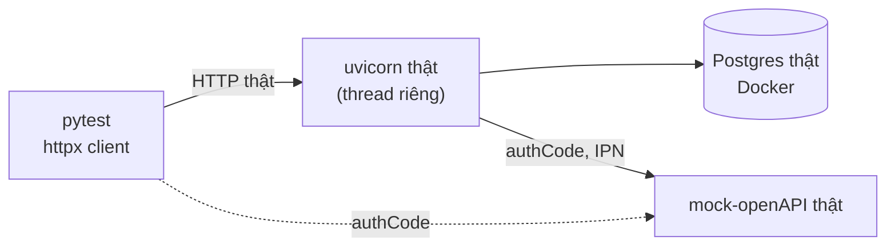

# Ngày 15 — Kiểm thử

**138 ca**, chạy qua HTTP thật. Ma trận 57 kịch bản trong
`Plan.xlsx › Test scenarios` đều có file chứng minh, ghi ở cột *Ghi chú*.

```bash
cd server
.venv/Scripts/python.exe -m pytest                 # tất cả
.venv/Scripts/python.exe -m pytest -m "not slow"   # bỏ nhóm tải
```

---

## 1. Không mock tầng nào



Test khởi động **uvicorn thật**, gọi qua HTTP, dùng **Postgres thật** và
**mock-openAPI thật**. Không có `TestClient` chạy in-process, không patch
database.

Đắt hơn, nhưng bắt được đúng loại lỗi mà unit test bỏ sót — hai lỗi tệ nhất
của dự án này đều thuộc loại đó:

- khoá `SELECT … FOR UPDATE` **biến mất** vì SQLAlchemy trả object từ
  identity map;
- **cạn connection pool** khi 20 người mua cùng lúc.

Cả hai chỉ lộ ra khi có tiến trình thật, transaction thật, đồng thời thật.

### Cái giá phải trả

Test **truncate mọi bảng** nó đụng tới sau mỗi ca — không rollback được, vì
app chạy ở thread khác với session riêng.

> Chạy pytest xong thì **dữ liệu demo mất**. Seed lại bằng
> `scripts/seed_demo.py`.

Vài thứ khác cũng phải dọn tay vì dùng chung tiến trình:

- **bộ đếm rate limit** — không reset thì ca sau ăn 429 của ca trước;
- **`merchant_ipn_url` của mock** — ca đối soát cố tình bẻ nó, và phải trả về
  **đúng giá trị cũ**;
- **`payment_exceptions`** — bảng này cố ý không có khoá ngoại (tiền có thể
  tới cho đơn không tồn tại), nên `CASCADE` không với tới, phải liệt kê tên
  trong câu `TRUNCATE`.

---

## 2. Ma trận đối chiếu được

Mỗi ca test đặt tên theo ID trong sheet:

```python
async def test_ord_04_repeated_checkout_creates_one_order(base_url):
```

Nhờ vậy một dòng trong Plan tra ngược được ra file, và ngược lại.

| File | Phủ |
|---|---|
| `test_auth_flow.py` | AUTH-01…03 |
| `test_shops.py`, `test_products.py` | PROD-01…05, AUTH-04/05, xoá sản phẩm (xoá cứng vs lưu trữ) |
| `test_orders.py` | ORD-01/02/03/05, CART-01/03, INV-05 |
| `test_payments.py` | PAY-01…05, STATE-01 |
| `test_fulfilment.py` | STATE-02/03, AUTH-05 |
| `test_variants.py` | INV-05 mức phân loại |
| `test_vouchers.py` | luật giảm giá |
| `test_inventory_hold.py` | INV-01/03/04 |
| `test_matrix_orders.py` | ORD-04/06, CART-02/04/05, SEC-01/02 |
| `test_matrix_flows.py` | AUTH-06, CART-06, INV-02/06/07, PAY-06, STATE-06, SEC-04, E2E-01…03 |
| `test_matrix_guards.py` | PROD-06/07/08, STATE-04/05, SEC-03/05 |
| `test_matrix_load.py` | LOAD-01/02/03 |

**Không đánh Pass cho ca chưa có test.** Có giai đoạn 21 dòng để "Not Run" vì
chúng mô tả tính năng dự án chưa có — một ma trận nhận phủ nhiều hơn thực tế
còn tệ hơn ma trận thừa nhận thiếu.

---

## 3. Nhóm tải: không phải benchmark

`test_matrix_load.py` đánh dấu `slow`. Nó chạy **một worker uvicorn và một
container Postgres trên laptop**, nên con số ở đây không nói gì về năng lực
production — chính sheet cũng ghi là cần môi trường riêng.

Điều kiện pass là **đúng đắn và hoàn tất**, không phải ngưỡng độ trễ:

- 100 người đọc storefront → 100 phản hồi 200, không ai bị chặn;
- 20 checkout đồng thời → không đơn trùng, không bán quá, tồn kho về đúng 0;
- tăng dần 10 → 25 → 50 → mọi request đều trả về trang thật.

Đặt ngưỡng thời gian ở đây chỉ là đo cái laptop.

---

## 4. Lỗi thật do test tìm ra

Đây là phần đáng giá nhất của cả ngày 15.

| Lỗi | Test bắt được |
|---|---|
| Hai người cùng mua món cuối **đều thắng** — `session.get` trả identity map, không chạy `FOR UPDATE` | `test_two_buyers_race_for_the_last_unit` |
| Cạn connection pool khi 20 checkout đồng thời (mặc định 5+10) | `LOAD-02` |
| **IPN cho đơn đã huỷ trả 200** — cổng tưởng xong, tiền đã trừ, hàng đã trả lại kho | `E2E-03` |
| Từ cấm một âm tiết chặn nhầm `kẹo sung sướng` | `PROD-07` |
| Response không escape `<` | `PROD-08` |
| Idempotency bắt `IntegrityError` làm bẩn connection, request kế tiếp cũng chết | `ORD-04` bản đồng thời |

Ba cái đầu đều là **lỗi mất tiền hoặc mất hàng**. Không cái nào lộ ra nếu chỉ
đọc code.

---

## 5. Frontend

```bash
cd v-market && npx tsc --noEmit
```

Chưa có test frontend. Đây là khoảng trống thật, chỉ đỡ ở chỗ mọi luật về
tiền và tồn kho đều nằm ở server và đã được phủ — client sai thì hiển thị
sai, chứ không tính sai tiền.

> **Đừng chạy `prettier --write` lên repo.** `.prettierrc` hiện không khớp
> style code đang có; một lần chạy format lại 30 file, +1124 dòng rác.
