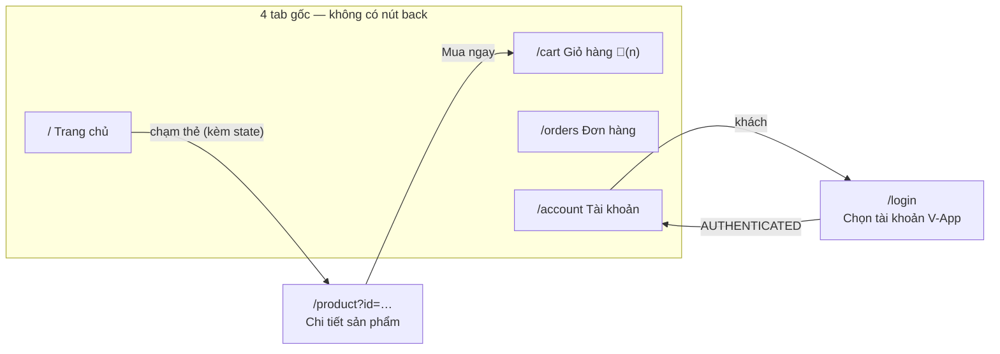
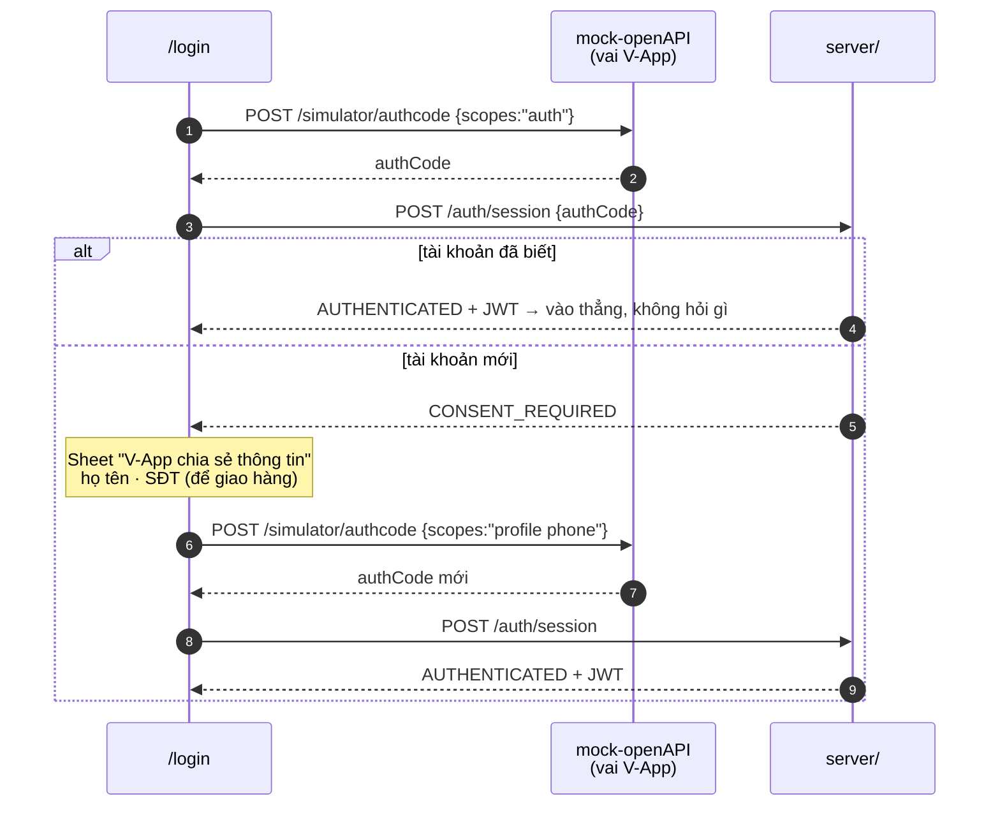
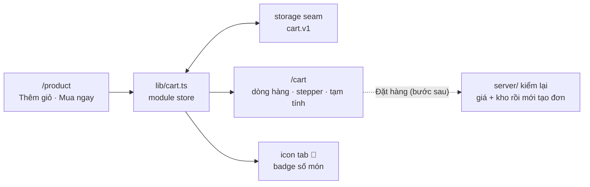

# Frontend V-Market — kiến trúc MiniApp

Tài liệu này giải thích code trong `v-market/src`: màn hình nào, dữ liệu chảy thế nào, và những chỗ phải lách thư viện.

---

## 1. Bản đồ màn hình



Luật route (từ [platform-constraints.md](platform-constraints.md) §3):

- **Một tầng, chữ thường** — chi tiết dùng query (`/product?id=…`), không có `/product/123`
- Path chưa đăng ký → **âm thầm về trang chủ**, nên tab hỏng trông như tab chạy
- **Nút back**: một component ở `Layouts` cấp app bọc mọi trang, tự ẩn ở 4 tab gốc — trang mới sinh ra sau tự có back, không ai phải nhớ
- **Tab bar tự ẩn** ở trang không có `bottomTabBarId` (`/product`, `/login`) — nhường chỗ cho thanh Mua ngay
- Tab đang đứng nổi lên: `activeColor` teal + `activeIcon` bản fill + nâng nhẹ

## 2. Các tầng

```
pages/            màn hình — giữ state của màn đó
components/       khối giao diện dùng lại (promo, flash sale, lưới, back button…)
lib/              cart.ts · auth.ts · storage.ts · format.ts — store và tiện ích
api/              auth.ts · products.ts · shops.ts — gọi backend/mock, có type
api/client.ts     CHỐT CHẶN duy nhất chọn transport
```

### `client.ts` — luật chọn đường

| URL | Đi đường nào | Vì sao |
|---|---|---|
| `https://…` + có bridge | `apisAsync.request` | máy thật: **không có `fetch`**, bridge chỉ nhận https |
| `http://…` (dev) | `fetch` của trình duyệt | bridge từ chối http ngay phía client; Simulator là trình duyệt thật nên fetch tồn tại — đổi lại `server/` và `mock-openAPI/` phải bật CORS cho origin localhost |
| bắt đầu bằng `http` | dùng nguyên | luồng auth gọi mock ở base riêng (`VITE_VAPP_BASE`) |

Chuyển sang máy thật = đổi **một dòng `.env`** sang https, không đổi code.

### Store là module, không phải Context

`Layouts` của router bọc **từng trang một** — đặt Provider ở đó là mỗi trang một bản state riêng. Nên `cart.ts` và `auth.ts` là module singleton + `useSyncExternalStore`: một state, mọi trang nhìn chung, component nào cũng subscribe được (kể cả icon tab nằm trong config tĩnh).

### `storage.ts` — seam lưu trữ

Trong V-App đi storage JSAPI (nền tảng sẽ bỏ `localStorage`/cookie), ngoài V-App rơi về `localStorage`. Hỏng thì trả `null`, không sập màn hình. Giỏ (`cart.v1`) và phiên (`session.v1`) đều đi qua đây.

## 3. Đăng nhập — consent hai giai đoạn thành hình



- Consent hiện **đúng một lần trong đời** mỗi tài khoản — tạo tài khoản mới ở `/login` là cách xem nó
- Từ chối consent → ở lại làm khách, duyệt hàng bình thường (quy chế §3.4.8)
- Client **chỉ cầm JWT của V-Market** — access token của V-App không bao giờ rời server
- **Seam mock↔thật nằm trọn trong `api/auth.ts`**: chỉ chỗ lấy authCode là swappable (thật = `apisAsync.getAuthCode`, cần app đăng ký DevCenter — không có). Mọi thứ sau authCode giống hệt nhau ở hai chế độ
- Trên máy thật, cả màn `/login` **không tồn tại** — người dùng đã đăng nhập V-App sẵn, `getAuthCode` chạy im lặng

## 4. Giỏ hàng — nằm ở client



Vì sao client: thêm-giỏ phải chạy **không cần đăng nhập**. Giá trong giỏ chỉ là **ảnh chụp để hiển thị** — lúc đặt hàng server kiểm lại giá và kho, client không bao giờ là nguồn sự thật về tiền. Thêm lại món đã có thì làm mới ảnh chụp, giỏ luôn hiện giá người mua vừa nhìn thấy.

Badge trên tab: config app dựng một lần và `IBottomTabBarItem` không có trường badge — nhưng `icon` nhận ReactNode, nên `<CartTabIcon />` là component sống subscribe store từ trong config tĩnh.

## 5. Dữ liệu thật vs demo

| | Nguồn |
|---|---|
| Danh sách sản phẩm, giá, giá sale, quy cách, tên shop | **Postgres** qua `GET /products` (một fetch nuôi cả lưới lẫn dải flash — flash = món có `originalPrice`) |
| Chi tiết sản phẩm | state từ thẻ (mở tức thì) hoặc `GET /products/{id}` khi vào bằng link |
| Đăng nhập, vai trò | **thật** — luồng ngày 1 |
| Mảng demo trong flash/lưới | chỉ còn là **dự phòng** khi backend tắt |
| "Đã bán", "Giao x ngày", "Kho…" | bịa ở thẻ demo — chờ bảng đơn hàng |
| Chữ khuyến mãi banner, nút Đặt hàng | placeholder có chủ đích, ghi rõ trong code |

Gieo lại dữ liệu (test chạy xong là mất): `cd server && .venv\Scripts\python.exe scripts/seed_demo.py`

## 6. Chỗ phải lách thư viện

Chi tiết ở [platform-constraints.md](platform-constraints.md) §10; điểm lại cái đã đụng thật:

| Vấn đề | Cách lách |
|---|---|
| `Image lazy` không bao giờ nạp ảnh trong app này | bỏ `lazy`; ảnh đầu trang eager là đúng LCP |
| `Carousel` mặc định `align:'center'` làm banner lệch trái | `align:'start', gap:0` |
| Toast neo theo navigation bar đã ẩn → bị status bar che | 2 rule CSS neo lại theo `--vsf-title-bar-height` / thanh đáy; toast dùng `position:'bottom'` |
| Cụm `⋯ ✕` của V-App đè lên trang, không chiếm layout | nội dung hàng đầu chừa vùng đó; "Xem tất cả" thuộc hàng Flash sale nằm dưới |
| Bộ icon không có cart/giỏ | emoji ReactNode làm icon tab |

## 7. Chạy

```bash
docker compose up -d
cd mock-openAPI && .venv\Scripts\python.exe -m uvicorn main:app --port 4001 --reload
cd server      && .venv\Scripts\python.exe -m uvicorn app.main:app --port 4000 --reload
cd v-market    && npm run dev     # Simulator :3000+, MiniApp :8080+
```

Mở bằng **`localhost`**, không phải `127.0.0.1` — dev server chỉ bind IPv6.
