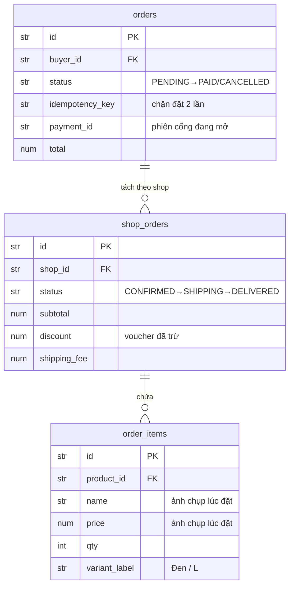
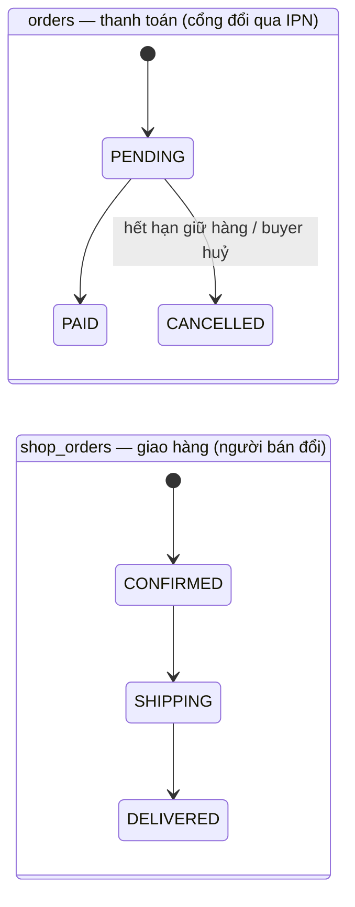
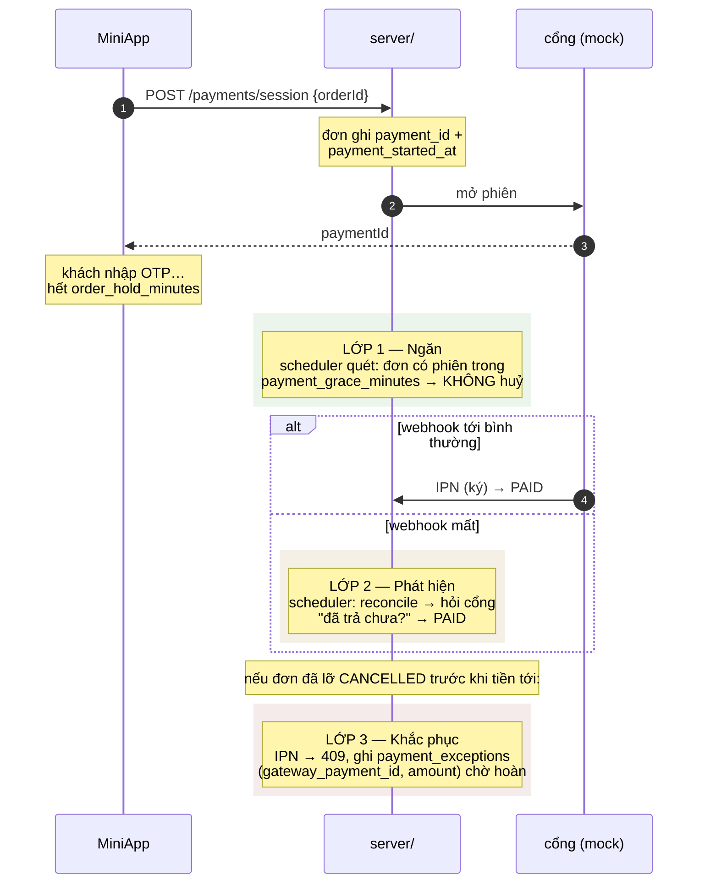

# Đơn hàng — đặt, trả tiền, giao

Nối tiếp [products.md §5](products.md#5-tiếp-theo--đơn-hàng), nơi đã chốt mô
hình **B**. Đây là phần đã dựng thật: đặt hàng, thanh toán qua cổng giả
lập, và người bán xử lý giao hàng.

> Tài liệu này viết ở giai đoạn đầu. Từ đó hệ thống có thêm **giữ hàng có
> thời hạn**, **idempotency khi đặt hàng**, và **ba lớp bảo vệ tiền của
> người mua** — xem [§6](#6-tiền-của-người-mua) ở cuối. Phần voucher và
> phân loại sản phẩm nằm ở [vouchers-variants.md](vouchers-variants.md).

---

## 1. Model B, như đã dựng



Điểm làm nó thành model **B**: `order_items` treo vào **`shop_orders`**, không
treo vào `orders`. Treo thẳng vào `orders` thì chỉ là dán nhãn shop lên từng
dòng hàng — vẫn là model A.

Hai loại trạng thái **tách biệt**, không dùng chung một cột. Thanh toán có
**một**, giao hàng có **nhiều**: shop A gửi trong 2 tiếng, shop B ba ngày
sau. Một cột trạng thái cho cả đơn thì không trả lời nổi câu "đơn này tới đâu
rồi".



`shop_orders` chỉ bắt đầu chạy **sau khi** `orders` thành `PAID` — chưa trả
tiền thì chưa có gì để giao.

---

## 2. Đặt hàng: tiền và tồn kho không đến từ client

Client chỉ gửi **id sản phẩm + số lượng**. Giá đọc lại từ DB trong đúng
giao dịch khoá tồn kho, nên giỏ cũ hay giỏ bị sửa không mua được theo giá
hôm qua.

```python
for product_id in sorted(wanted):          # khoá theo thứ tự cố định
    product = await session.get(Product, product_id, with_for_update=True)
```

Ba điểm cố ý:

- **Khoá theo thứ tự đã sắp** — hai checkout khoá `{A,B}` và `{B,A}` sẽ
  deadlock; cùng khoá theo thứ tự sắp thì không.
- **Tất-cả-hoặc-không** — thiếu hàng một nửa thì cả đơn bị từ chối (409),
  không âm thầm bỏ nửa hết hàng và giao khác với cái người mua đã xác nhận.
- **`order_items` chép tên/giá lúc đặt** — hoá đơn là bức ảnh, không phải
  cửa sổ. Người bán đổi giá ngày mai, receipt hôm qua giữ nguyên.

Đơn vừa đặt ở trạng thái `PENDING`: đã tạo, chưa trả tiền.

---

## 3. Thanh toán: cổng giả lập + IPN ký

Quy chế §5.1.2 **cấm COD** — tiền phải đi qua cổng của sàn. Nên có một cổng
giả lập, và cổng báo về server bằng **IPN** (thông báo server-to-server),
đúng hình dạng cổng thật.

IPN ký bằng **HMAC-SHA256** trên `f"{orderId}|{amount}|{status}"` với khoá
chung. Server verify trước khi tin:

```python
if settings.payment_verify_hash and not verify_hash(secret, order_id, amount, status, secure_hash):
    raise HTTPException(400, "Bad signature")   # so sánh hằng thời gian
```

- **Số tiền so với `order.total` của chính đơn** — IPN bị sửa không trả
  thiếu hơn số phải trả được.
- **Idempotent** — cổng retry tới khi nhận 200, nên cùng một IPN có thể tới
  nhiều lần; IPN cho đơn đã `PAID` là thành công, không phải lỗi.

Chỉ khi `PENDING → PAID` xong, đơn mới thành việc thật cho người bán.

---

## 4. Giao hàng: người bán đẩy trạng thái

Nửa còn lại của model B. Người bán làm việc trên **queue của shop mình**:

```
GET   /orders/shop?status=SHIPPING   → các lát đơn của shop mình
PATCH /orders/shop/{id}  {status}    → đẩy một lát tiến một bước
```

Bốn ràng buộc, tất cả ở tầng server (không bao giờ chỉ ở UI):

- **Chỉ đơn `PAID` hiện ra.** Chưa trả tiền thì chưa có gì để giao —
  `list_for_shop` join lên `orders` và lọc `status == "PAID"`.
- **Một bước một.** `CONFIRMED → SHIPPING → DELIVERED`; server chỉ nhận
  đúng bước kế tiếp hợp lệ, nên bấm hai lần hay nút cũ không nhảy cóc hay
  lùi được.

  ```python
  expected = _FULFILMENT_NEXT.get(shop_order.status)   # {"CONFIRMED":"SHIPPING", "SHIPPING":"DELIVERED"}
  if target != expected:
      return shop_order, order, [], "INVALID_TRANSITION"   # → 409
  ```

- **Khoá theo shop của người gọi (AUTH-05).** `PATCH` giới hạn vào shop của
  seller đang gọi; chạm lát của shop khác trả **404**, để không dò được id
  nào tồn tại — cùng luật với shop và order ở chỗ khác.
- **`CANCELLED` không nằm trong bậc thang.** Huỷ sau khi đã trả tiền nghĩa
  là hoàn tiền, mà cổng giả lập chưa mô hình hoá; nên endpoint này không
  nhận `CANCELLED`.

Route seller đặt **trên** `GET /orders/{order_id}` trong file: đăng ký
trước thì `/orders/shop` khớp trước, không bị route bắt-tất-cả `{order_id}`
nuốt mất chữ "shop".

---

## 5. Test

`tests/test_orders.py` (6), `tests/test_payments.py` (6),
`tests/test_fulfilment.py` (6). Fulfilment kiểm:

- chỉ đơn `PAID` vào queue; đơn chưa trả tiền thì không
- đi đúng `CONFIRMED → SHIPPING → DELIVERED`; nhảy cóc hoặc đi tiếp sau
  `DELIVERED` → 409
- seller khác không thấy và không đẩy được lát của shop mình (404)
- lọc theo `status` thu hẹp đúng queue
- buyer chưa có shop gọi endpoint seller → 403

---

## 6. Tiền của người mua

Phần này viết sau, khi hệ thống đã chạy và câu hỏi chuyển từ "có đặt được
hàng không" sang "mất mạng giữa chừng thì sao".

### Điều phải hiểu trước

Khách mất mạng **không** ngăn được giao dịch — cổng và ngân hàng vẫn xử lý
xong. Nên "khách mất tiền" không bao giờ là *tiền không trừ*, mà là:

> **tiền đã trừ nhưng đơn không thành `PAID`.**

Vì vậy client không bao giờ được là thứ báo "đã thanh toán". Đơn chỉ đổi
trạng thái khi **IPN server-to-server** tới, có chữ ký, và xử lý idempotent.

### Giữ hàng có thời hạn

Đặt hàng trừ kho ngay — đó chính là cách chặn hai người giành món cuối
(INV-05). Cái giá phải trả: một giỏ hàng bỏ dở sẽ giữ món đó mãi mãi.

Nên khoản giữ có hạn. Quá `order_hold_minutes`, đơn `PENDING` bị huỷ và mọi
dòng hàng được trả về đúng chỗ đã lấy đi — biến thể nếu có chọn, không thì
sản phẩm. **Chính trạng thái đơn là cái chặn cộng lại hai lần**: đơn đã
`CANCELLED` không còn `PENDING` nên lượt quét sau bỏ qua.

### Ba lớp bảo vệ

| | Cơ chế | Vì sao |
|---|---|---|
| **Ngăn** | `POST /payments/session` mở phiên **qua server**, đơn ghi `payment_id`; đơn có phiên sống được giữ thêm `payment_grace_minutes` | Trước đây client gọi thẳng cổng, server không phân biệt được "bỏ giỏ" với "đang nhập OTP" — và huỷ nhầm cái thứ hai |
| **Phát hiện** | `POST /payments/reconcile` hỏi cổng về đơn chưa nhận được webhook | Webhook có thể mất: server sập một phút, hết lượt retry, mạng nuốt mất |
| **Khắc phục** | Tiền không áp được ghi vào `payment_exceptions` kèm `gateway_payment_id` và số tiền | Trả lỗi cho cổng chỉ ngăn mình nói dối; nó không trả tiền lại cho ai cả |

Thứ tự là có chủ ý: **chặn không cho xảy ra**, **tự biết khi vẫn xảy ra**,
**sửa được hậu quả**.

Kịch bản đắt nhất — khách đang nhập OTP thì hết hạn giữ hàng — chạy qua cả ba
lớp như sau:



### Chạy nền

Cả việc trả hàng về kho lẫn việc đối soát đều chạy trong
[`app/scheduler.py`](../../server/app/scheduler.py), mỗi
`scheduler_interval_seconds` một lượt. Trước đó chúng chạy ké theo request
người dùng — nghĩa là một đêm vắng khách thì hàng bị giữ cứ nằm đó, và lưới
an toàn cho webhook chỉ hoạt động nếu có người nhớ bấm.

**Giới hạn, nói thẳng:** chạy in-process nên nhiều worker thì mỗi worker
chạy một bản, poll trùng nhau. Vô hại vì cả hai job đều idempotent, nhưng
production thật cần leader lock hoặc trigger từ ngoài.

### Đặt hàng lặp

`POST /orders` nhận header `Idempotency-Key`: cùng key trả về **cùng một
đơn** thay vì mua hai lần. Trước khi đọc gì, request lấy
`pg_advisory_xact_lock` trên chính cái key — request thứ hai chờ request đầu
commit rồi đọc thấy đơn.

Cách đầu tiên tôi làm là bắt `IntegrityError` từ ràng buộc unique rồi đọc
lại. Nó **sai**: lúc ràng buộc nổ, request thua đã ở sâu trong transaction
đang giữ khoá tồn kho, và phục hồi từ một `flush` hỏng để lại connection bẩn
khiến **request kế tiếp cũng chết**. Ràng buộc unique vẫn còn, làm lớp chặn
cuối.
