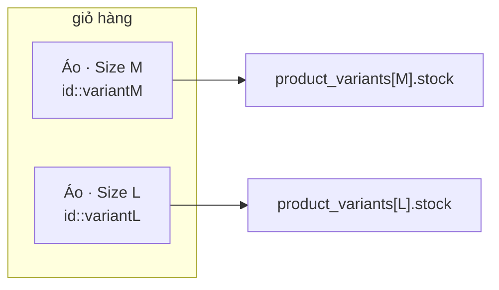

# Ngày 5–6 — Người mua duyệt hàng và bỏ giỏ

Phần người mua nhìn thấy trước khi đăng nhập. Ràng buộc lớn nhất đến từ quy
chế: **app phải dùng được khi chưa định danh** (xem
[platform-constraints.md §2](../day3/platform-constraints.md)). Nên mọi thứ
ở đây — trang chủ, tìm kiếm, giỏ hàng — chạy không cần token.

---

## 1. Duyệt hàng

`GET /products` là endpoint công khai, trả về **card đã đủ dữ liệu** chứ
không phải bản ghi thô. Mỗi dòng mang theo:

| Trường | Vì sao ở đây |
|---|---|
| `shopName`, `shopProvince` | để card ước tính thời gian giao, không cần gọi thêm |
| `ratingAverage`, `ratingCount` | tính từ reviews |
| `sold` | tính từ đơn **đã thanh toán** |
| `effectivePrice`, `voucher` | giá sau mã giảm tốt nhất |
| `variants` | có phân loại hay không |

Rating và `sold` đến từ **subquery left-join**, không phải vòng lặp N+1.
`_metric_subqueries()` trong `products/store.py` gom cả hai lại rồi join một
lần cho cả trang.

### Danh mục nằm ở client

Server chỉ lưu **khoá** (`dien-tu`, `thoi-trang`…). Nhãn và emoji nằm trong
`lib/categories.ts`. Đổi tên hiển thị là sửa một file frontend, không phải
migration.

### Flash sale không có cờ riêng

Một sản phẩm "đang giảm" **chỉ vì `original_price` được đặt**. Không có cột
`is_on_sale` — hai con số sẽ lệch nhau. `?onSale=true` lọc đúng điều kiện đó,
và phần trăm giảm luôn được **suy ra**, không lưu.

### Kéo xuống làm mới — chỉ trang chủ

`PullToRefresh` bọc **riêng** trang chủ. Các tab khác (giỏ, đơn hàng, tài
khoản) tự nạp lại theo hành động của chúng; kéo ở đó chẳng làm mới cái gì có
nghĩa, nên chỉ storefront có cử chỉ này.

Component tự tìm **scroll-parent gần nhất** và chỉ kích hoạt khi đang ở đỉnh,
nên không cần cấu hình gì thêm — bọc là chạy, và dải cuộn ngang (flash sale)
không nuốt cử chỉ vì nó cuộn theo trục X.

Hai khác biệt so với lần nạp đầu:

- **Không quay về skeleton.** Sản phẩm đang xem đứng yên trong khi trang mới
  về — chớp sang khung xám giữa chừng là khó chịu.
- **Hỏng thì giữ nguyên màn hình**, chỉ toast "Không làm mới được". Nạp lần
  đầu mới hiện trang lỗi, vì lúc đó chưa có gì để giữ.

`onRefresh` **trả về promise** để spinner ở đỉnh chờ đúng lúc fetch xong mới
tắt, không tắt sớm.

---

## 2. Tìm kiếm

`GET /products?q=` tìm **server-side** theo tên sản phẩm hoặc tên shop, trên
toàn bộ catalogue — không phải lọc trang đã tải.

Ký tự đại diện của LIKE bị vô hiệu hoá trước khi ghép câu:

```python
def _escape_like(text: str) -> str:
    return text.replace("\\", "\\\\").replace("%", "\\%").replace("_", "\\_")
```

Không có bước này thì người dùng gõ `%` sẽ khớp mọi thứ — vô hại nhưng sai,
và là thói quen xấu để lại trong code chạm tới dữ liệu.

**Chỉ có một ô tìm kiếm trong cả app**, nằm ở `TopChromeLayout`. Trên
`/search` cái pill đó biến thành ô nhập thật, **đúng vị trí cũ**, nên chuyển
trang không bị nhảy. Hiệu ứng là `fade_in` chứ không phải `slide_left` mặc
định — trượt ngang sẽ phá cảm giác "cái pill vừa mở ra".

---

## 3. Giỏ hàng nằm ở client

Giỏ lưu trên máy, không lên server. Lý do là quy chế 3.4.8: duyệt và bỏ giỏ
phải làm được khi chưa đăng nhập. Đăng nhập chỉ chặn ở **checkout**, nơi
server kiểm lại giá và tồn kho.

Dùng **module store** với `useSyncExternalStore`, không dùng React Context:
app-level Layouts bọc từng trang riêng, nên một Provider đặt ở đó sẽ cho mỗi
trang một instance khác nhau.

### Một dòng giỏ là *sản phẩm + phân loại*

```ts
export const lineKey = (line: CartLine): string =>
  `${line.product.id}::${line.variant?.id ?? ''}`;
```



Áo size M và áo size L là **hai dòng, hai số lượng**. Trên server chúng là
hai dòng tồn kho khác nhau; gộp lại là giao sai size.

### Khoá lưu trữ đổi thành `cart.v2`

Giỏ lưu từ trước khi có phân loại có thể chứa sản phẩm mà **giờ bắt buộc
chọn size**. Checkout sẽ từ chối với thông báo "chọn phân loại" mà người mua
không thao tác được. Nên đổi khoá — giỏ cũ bị bỏ, còn hơn giỏ hỏng.

### Nhóm theo shop

Giỏ hiển thị **một thẻ cho mỗi shop**, khớp với cách server tách đơn và tính
phí ship theo từng shop. Người mua thấy trước cấu trúc mà hoá đơn sẽ có.

---

## 4. Card sản phẩm — một component, mọi nơi

`GridProductCard` dùng cho trang chủ, tìm kiếm, dải ngang, trang shop, thẻ
shop trong trang sản phẩm. Hai chi tiết đáng nói:

**Badge `-24%` tính cả markdown lẫn voucher.** Công thức nằm ở
`lib/product-card.ts`, dùng chung với dải flash sale. Trước đây flash sale có
bản riêng chỉ biết `oldPrice`; từ lúc có voucher là hai bản lệch nhau ngay —
badge nói một đằng, giá nói một nẻo.

**Tên shop bấm được, mà không lồng button.** Cả card là vùng bấm mở sản
phẩm, nên tên shop không thể là `<button>` bên trong `<button>`. Giải bằng
*stretched link*: card là `div`, một button phủ `absolute inset-0` mở sản
phẩm, tên shop là button riêng nổi lên bằng `z-10`.

**Lưới so le.** Dùng CSS `columns-2` thay vì `grid`, để mỗi card kết thúc
theo nội dung của nó thay vì bị kéo bằng card cao nhất cùng hàng.

---

## 5. Ảnh: không lazy, cố ý

`Image` của thư viện chỉ set `src` sau khi `VisibilitySensor` của nó fire —
mà **bên trong scroll container của app thì nó không bao giờ fire**, nên ảnh
âm thầm rơi về ô emoji.

Vì vậy mọi `Image` ở card đều **không** lazy. Ghi chú này còn quan trọng cho
việc khác: nó là lý do không nên làm "video tự phát khi vào khung nhìn" bằng
sensor của thư viện.
