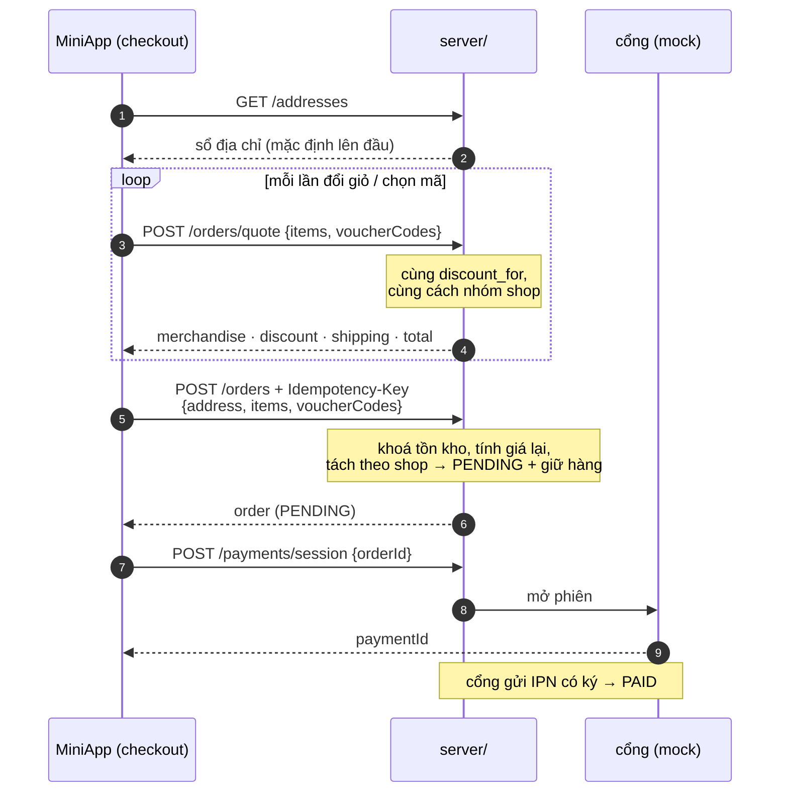

# Ngày 7 — Thanh toán: địa chỉ, báo giá, đặt hàng

Màn hình checkout làm ba việc: chọn nơi giao, cho người mua thấy **đúng số
tiền sẽ bị trừ**, và tạo đơn.



---

## 1. Sổ địa chỉ

Địa chỉ lưu **trên server, theo từng người dùng** — không phải trong máy —
vì người mua đổi thiết bị vẫn phải thấy chỗ giao quen thuộc.

`GET/POST /addresses`, `POST /addresses/{id}/default`, `DELETE`.

Ba luật nhỏ, tất cả ở tầng store:

- Địa chỉ **đầu tiên** tự thành mặc định. Không ai muốn thêm địa chỉ rồi phải
  bấm thêm một nút nữa.
- Đặt mặc định thì **bỏ cờ ở các địa chỉ khác** — không thể có hai mặc định.
- Xoá địa chỉ mặc định thì **địa chỉ mới nhất lên thay**, không để trống.

Server chỉ có **một trường địa chỉ dạng text** trên đơn hàng. Checkout gộp
tên, số điện thoại và dòng địa chỉ lại rồi gửi lên — hoá đơn cần một bản chụp,
không cần khoá ngoại tới một dòng người mua có thể xoá ngày mai.

---

## 2. Địa chỉ hành chính và định vị

### Dữ liệu tỉnh/huyện/xã đóng gói sẵn

`app/geo/` phục vụ `vn_admin.json` bundled: `/geo/provinces`,
`/geo/districts?province=`, `/geo/wards?district=`.

Không gọi API bên thứ ba lúc chạy vì **domain whitelist** — MiniApp chỉ gọi
được domain của mình. Dữ liệu tĩnh thì đóng gói là xong.

> Bộ dữ liệu có vài phường đảo thiếu `Id`/`Name`. `_units()` bỏ qua các bản
> ghi hỏng thay vì để một dòng lỗi làm sập cả danh sách tỉnh.

### JSAPI chỉ trả toạ độ

`getLocation` của V-App trả về **lat/lng, không có địa chỉ**. Muốn ra dòng
địa chỉ đọc được thì phải reverse geocode.

Whitelist chặn client gọi thẳng Nominatim, nhưng **server thì gọi được** —
ràng buộc nằm ở MiniApp, không nằm ở backend. Nên có
`GET /geocode/reverse?lat=&lng=`, gọi Nominatim từ server, và **hỏng thì trả
về nhẹ nhàng**: người mua vẫn gõ tay được, không bị chặn đường vì một dịch vụ
ngoài chậm.

---

## 3. Báo giá: server tính, client chỉ hiển thị

Trước đây checkout tự cộng giá trong giỏ. Từ lúc có voucher thì nó **báo cao
hơn số thật bị tính** — vì client không biết luật giảm giá.

Giờ checkout gọi `POST /orders/quote`, dùng **đúng cách nhóm theo shop và
đúng phép tính voucher** mà `place_order` sẽ dùng:

```
merchandise · discount · shipping · total
shops[] → subtotal, discount, shippingFee, voucherCode, vouchers[]
```

Đây là điểm cốt lõi của cả tính năng giảm giá: **giá quảng cáo phải bằng giá
bị tính**. Một hàm `discount_for` duy nhất phục vụ card, báo giá và hoá đơn.

Endpoint này **công khai** — nó không lộ gì hơn trang sản phẩm, và checkout
cần nó trước khi đăng nhập cũng không sao.

Trong lúc chờ báo giá, màn hình dùng tổng cộng thô làm dự phòng. Con số đó
chỉ có thể **cao hơn** thực tế (chưa trừ voucher), không bao giờ thấp hơn —
sai theo hướng an toàn.

---

## 4. Chọn mã giảm giá

Checkout liệt kê **mọi mã của shop**, kể cả mã chưa dùng được — làm mờ, không
bấm được, kèm lý do (`Cần thêm 4.310.000₫`). Mã người mua không nhìn thấy là
mã họ không thể phấn đấu tới.

Mã client gửi lên chỉ là **đề nghị**. Server kiểm lại còn hạn, đúng shop,
thực sự giảm được tiền; sai thì **âm thầm quay về mã tốt nhất** thay vì văng
lỗi giữa lúc thanh toán.

Chi tiết luật giảm giá: [vouchers-variants.md](../day3/vouchers-variants.md).

---

## 5. Đặt hàng

```
POST /orders
Idempotency-Key: <một key cho mỗi lần vào trang thanh toán>
{ address, items: [{productId, variantId?, qty}], voucherCodes? }
```

- **Client không gửi giá.** Chỉ id và số lượng; giá đọc lại từ DB trong đúng
  giao dịch khoá tồn kho.
- **Tất-cả-hoặc-không.** Thiếu hàng một dòng thì cả đơn bị từ chối 409, không
  âm thầm giao một nửa.
- **Idempotency-Key** để bấm hai lần không thành hai đơn — xem
  [orders.md §6](../day3/orders.md#6-tiền-của-người-mua).

Đặt xong, đơn ở `PENDING` và **đã giữ hàng**. Thanh toán mở qua
`POST /payments/session` (không gọi thẳng cổng, để server biết có phiên đang
mở), rồi cổng gửi IPN về.

### Một lỗi từng có ở màn hình này

`place()` gọi `clearCart()`, mà component có dòng
`if (lines.length === 0) return <EmptyCheckout />`. Kết quả: đơn tạo xong thì
màn hình nhảy sang "giỏ hàng trống" **trước khi** sheet thanh toán kịp mở —
đơn đã tạo mà người mua không thấy đường trả tiền. Điều kiện giờ có thêm hai
lá chắn `!placing && !payment`.

---

## 6. COD bị cấm

Quy chế §5.1.2 không cho thu tiền mặt khi giao. Nên chỉ có **một phương thức
thanh toán**, đi qua cổng của sàn. Điều đó cũng có nghĩa: không có đường nào
để đơn thành `PAID` mà không qua IPN có chữ ký.
