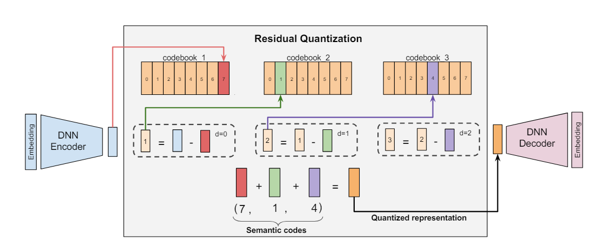

# V-Market AI Recommendation

Hệ gợi ý sinh cho catalog toàn cầu: nội dung sản phẩm được encode thành vector,
RQ-VAE lượng tử hóa vector thành Semantic Cluster ID ba tầng, rồi Transformer
dự đoán cụm sản phẩm tiếp theo từ chuỗi tương tác trong session.

<p align="center">
  
</p>

## Pipeline

```text
Amazon-M2 metadata
→ Jina multilingual embedding 256D
→ normalized mean theo global product_id
→ frozen RQ-VAE [128, 64, 32]
→ SID sequence của session
→ T5-style encoder-decoder Transformer
→ constrained Top-10 SID beam
→ sản phẩm ACTIVE trong PostgreSQL
```

Một SID là một cụm sản phẩm, không phải ID duy nhất của item. Ba code đi từ
coarse tới fine, nhờ đó serving có thể mở rộng full cluster trước rồi lùi về
prefix nông hơn khi catalog demo không đủ sản phẩm.

## Cấu hình đã chốt

| Khối | Cấu hình |
|---|---|
| Text encoder | `jinaai/jina-embeddings-v5-text-nano-clustering` |
| Embedding | normalized, truncate còn 256 chiều |
| RQ-VAE | input 256, hidden `[256,128,64]`, latent 32, codebook `[128,64,32]` |
| Quantization | rotation trick, commitment weight 0.25, 50.000 bước |
| Transformer | 4 layer, `d_model=384`, 6 head, `d_ff=1024` |
| Training | batch 256, fp16, LR `2e-4`, warmup 5.000, 200.000 bước |
| Evaluation | fixed subset 20.000 mỗi 20.000 bước, full validation ở cuối |
| Inference | constrained beam search, beam 10, Hit@1/5/10 và NDCG |

RQ-VAE hiện dùng 136.539 full SID trên 1.410.675 sản phẩm. Median cluster là 4
sản phẩm, p90 là 23; collision được giữ có chủ đích để gom tín hiệu và mở rộng
candidate thay vì thêm suffix để ép mỗi item thành một SID riêng.

## Notebook Kaggle

| Notebook | Đầu ra |
|---|---|
| `01_preprocessing.ipynb` | KuaiSearch ranking splits, catalog và product embeddings |
| `02_eda_rqvae.ipynb` | PCA và pilot sweep cho hidden dims/codebook sizes |
| `03_train_rqvae.ipynb` | RQ-VAE checkpoints và fixed `semantic_ids.parquet` |
| `04_train_transformer.ipynb` | Transformer baseline; sẽ được viết lại cho Phase B teacher–student |

Notebook chỉ orchestration; model và training loop nằm trong `src/`. Config cuối
được lưu tại `src/configs/rqvae_kuaisearch.gin` và
`src/configs/transformer_vmarket.gin`.

Chạy script trực tiếp sau khi sửa đường dẫn dataset trong Gin config:

```bash
python src/train_rqvae.py src/configs/rqvae_kuaisearch.gin
python src/train_decoder.py src/configs/transformer_vmarket.gin
```

## Artifact

Dataset và output lớn không được commit. Serving tự phát hiện:

```text
output/rq-vae/checkpoint_49999.pt
output/rq-vae/semantic_ids.parquet
output/transformer/best_checkpoint.pt
```

Nếu không có `best_checkpoint.pt`, resolver chọn Transformer checkpoint có step
lớn nhất. RQ-VAE luôn chọn checkpoint số lớn nhất. Parquet được dùng cho train và
seed demo; khi phục vụ, Transformer mask đọc live SID của sản phẩm `ACTIVE` từ
PostgreSQL.

Sản phẩm mới không làm model train lại. FastAPI dùng đúng Jina encoder và frozen
RQ-VAE để gán SID trong cùng codebook, ghi vào database rồi refresh prefix mask
mà không reload Transformer.

## Nền tảng nghiên cứu

Thiết kế kế thừa ý tưởng generative retrieval và residual quantization, sau đó
điều chỉnh theo catalog cluster của V-Market:

- [TIGER](../Phase_2_docs/TIGER/TIGER.pdf): Semantic ID và generative retrieval.
- [GR4AD](../Phase_2_docs/GR4ND/GR4AD.pdf): multi-resolution codebook và LazyAR.
- [CQ-SID](../Phase_2_docs/CQ-SID/CQ-SID.pdf): cluster-oriented Semantic ID.
- [TSGR](../Phase_2_docs/TSGR/TSGR.pdf): giới hạn thông tin của SID và item-level ranking.

Phần tóm tắt so sánh nằm tại
[`SUMMARY_4PAPER.md`](../Phase_2_docs/Docs/SUMMARY_4PAPER.md).
